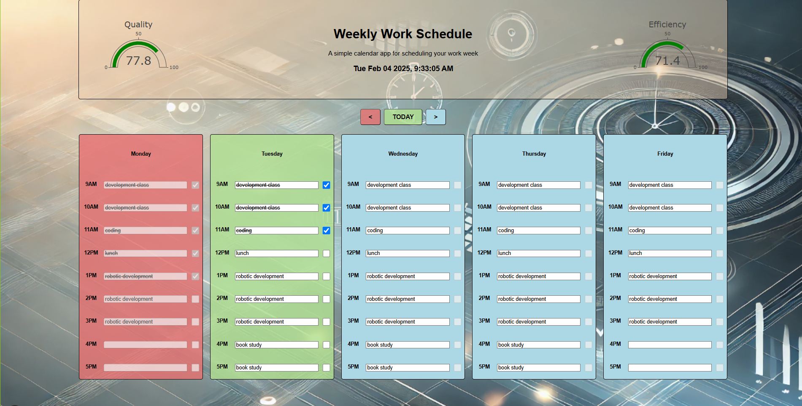

# Work Week Scheduler

## Website: 
[website](https://workweekscheduler-f0d43aaa27a0.herokuapp.com/)

## Description
A five-day workweek scheduler that tracks quality and efficiency. 

## Table of Contents
- [Installation](#installation)
- [Usage](#usage)
- [Credits](#credits)
- [License](#license)
- [Features](#features)

- [Contact](#contact)

## Installation
html, css, javascript, plotly

## Usage
Populate your tasks and check them off when completed.

## Credits
Jason Cano

## License
MIT
